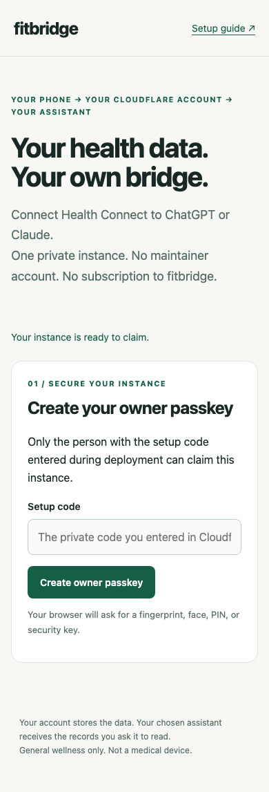

# fitbridge for Health Connect

Your Android health records, available to ChatGPT and Claude through a service you host in your own free Cloudflare account.
The maintainer has no access to your instance or your health data.

[](https://deploy.workers.cloudflare.com/?url=https://github.com/x-senpai-x/fitbridge)

[Setup guide](https://x-senpai-x.github.io/fitbridge/) · [Troubleshooting](docs/runbook.md#troubleshooting) · [Privacy](docs/privacy.md) · [Security](SECURITY.md)

**Public beta.**
The original Android-to-ChatGPT flow has been tested by the owner with real Fitbit records.
The new passkey and pairing flow is checked with synthetic records and a browser authenticator.
A ten-minute setup with a first-time user has not been measured.

```text
Wearable → Health Connect → Life Dashboard Companion
                                  ↓ signed webhook
                         Your Cloudflare Worker
                           D1 + OAuth + MCP
                                  ↓ read-only
                           ChatGPT or Claude
```

## Start here

You need Android 14+, a wearable/app that actually writes the relevant records to Health Connect, a free Cloudflare account, a GitHub account, and an assistant plan supporting custom MCP connections.
Fitbit is the tested source.
Other Health Connect sources can use the same receiver, but their device behavior and exported metrics are not yet verified here.
iPhone is experimental and is not part of the supported setup path.

1. [Generate a private setup code](https://x-senpai-x.github.io/fitbridge/#setup-code), or create one with your password manager.
2. Click **Deploy to Cloudflare** and enter that value as `SETUP_CODE`.
   The template creates your D1 database and OAuth KV namespace.
   Keep the Workers Free plan selected and retain the generated binding IDs in your copy.
3. Open your new Worker URL, enter the setup code, register a passkey, and save the recovery code.
4. Save your time zone and primary data source before syncing.
   Install [Life Dashboard Companion 1.21.2](https://github.com/owen282000/life-dashboard-companion-app/releases/tag/1.21.2), then scan the private pairing QR with its pairing scanner.
5. Select the 13 supported types shown on the page, keep raw resolution, and run a real sync.
   The companion's unsigned onboarding test ping is expected to fail.
6. Copy the MCP URL into ChatGPT Developer mode or Claude, authenticate with your passkey, and approve read-only access.

Ask: **“How did my sleep and HRV trend over the last 30 days?”**
The assistant should start with `get_overview` to check whether those records exist.
See the [full runbook](docs/runbook.md) for Android permissions, APK verification, backfills, and terminal setup.



## What it provides

Nine read-only MCP tools: overview, daily summaries, sleep, workouts, intraday series, trends, correlation, search, and fetch.
Supported raw types are heart rate, HRV, resting heart rate, respiratory rate, oxygen saturation, skin temperature, sleep, exercise, steps, distance, total calories, VO2 max, and weight.
Missing measurements remain unknown rather than becoming zero.
Fitbit's proprietary sleep score, readiness, cardio load, and stress scores are not reconstructed.
Heart-rate zones and active zone minutes are labeled estimates.

The Worker verifies HMAC-SHA256 signatures before accepting phone data.
Browser setup is protected by a passkey, required user verification, and a private bootstrap code.
OAuth consent names the assistant and the redirect URI before granting access.
New clients can use CIMD; DCR remains available for compatibility.
The setup page provides pairing, recent signed-sync status, key rotation, recovery-code regeneration, and redacted diagnostics.

## Cost and limits

fitbridge has no fee and uses no paid AI API.
Your chosen assistant may require a paid subscription.
The default deployment targets Workers Free, D1, and KV; it does not automatically upgrade an account.
Free quotas can pause ingestion, especially during historical backfills or unusual traffic.
Backfills pause at 70,000 tracked daily row writes and live syncs at 90,000, leaving headroom under D1's free quota.
These guards are approximate: migration/manual writes and platform overhead are not all counted.
See [quotas and updates](docs/maintenance.md).

## Privacy and security

Your Cloudflare account stores the records and signing key.
The maintainer operates no shared data collection endpoint.
Your selected assistant receives data returned by the tools you authorize it to use.
Review its retention and training settings before connecting.
Public documentation and tests use composed or synthetic fixtures, not the owner's captured payloads.
Persistent Worker logs are disabled by default; do not share unredacted live logs or pairing/recovery codes.
Read the [privacy statement](docs/privacy.md), [threat model](docs/threat-model.md), and [reporting policy](SECURITY.md).

fitbridge is a general wellness tool, not a medical device or a source of medical advice.
Fitbit, Health Connect, ChatGPT, Claude, and Cloudflare are names of the products it works with.
This project is independent and is not endorsed by those companies or by other applications named FitBridge.

## Develop and contribute

```bash
npm ci
npm run build
npm run typecheck
npm test
npm run smoke
npx playwright install chromium
npm run test:browser
```

Use Node 24 or newer.
Copy `.dev.vars.example` to `.dev.vars` and set a private local setup code before `npm run dev`.
Tests use local workerd/D1 and synthetic data.
See [CONTRIBUTING.md](CONTRIBUTING.md), [design](docs/design.md), [shipping plan](docs/shipping-plan.md), and [release evidence](docs/release-readiness.md).

## License and companion

fitbridge is [MIT licensed](LICENSE).
The separately installed [Life Dashboard Companion](https://github.com/owen282000/life-dashboard-companion-app) is maintained by Owen Vogelaar and is not bundled or modified here.
Copied exporter documentation and derived fixtures retain its MIT notice.
Dependency notices are in [THIRD_PARTY_NOTICES.md](THIRD_PARTY_NOTICES.md).
